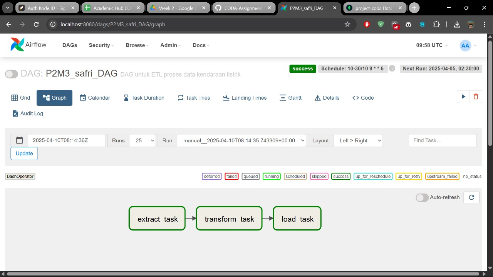
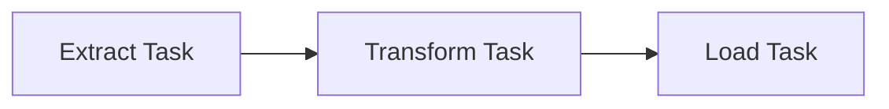
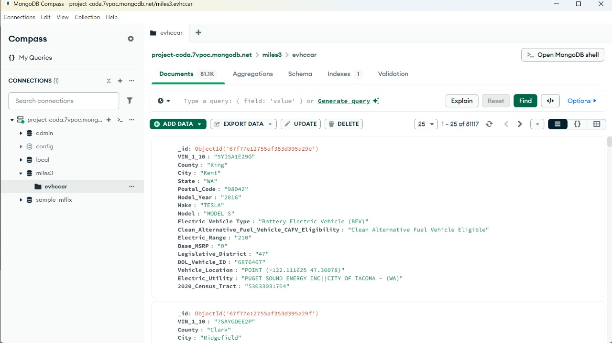

# 🚗 Project Data Analysis ETL - Kendaraan Listrik

## Deskripsi Proyek

Proyek ini merupakan implementasi proses **ETL (Extract, Transform, Load)** untuk menganalisis data kendaraan listrik dari Washington State, USA. Proses ini dijalankan menggunakan **Apache Airflow** dan data disimpan dalam **MongoDB Atlas**.

> Link presentasi proyek: [Google Slides - Project Presentation](https://docs.google.com/presentation/d/1Z6Kqp5ZbXNnt5JIZcMJE566E_JsNedFLXSsBUgVbxJ8/edit?usp=sharing)

---

## Struktur Proyek

### 1. 📁 Data

- `P2M3_Rakhmat-Safri_data_raw.csv` – Dataset mentah kendaraan listrik.
- Data juga tersedia dalam MongoDB pada collection `evhccar`.

### 2. 🛠️ ETL Pipeline (Airflow)

- DAG bernama `P2M3_safri_DAG`
- Terdiri dari 3 task utama:
  - `extract_task`
  - `transform_task`
  - `load_task`

### 3. 📦 Output

- Data telah dimuat ke MongoDB Atlas.
- Visualisasi dan query dapat diakses melalui MongoDB Compass.

---

## 📂 File Penting

| File | Deskripsi |
|------|-----------|
| `P2M3_rakhmat-safri_GX.ipynb` | Notebook eksplorasi dan transformasi data |
| `P2M3_rakhmat_safri_DAG_graph.jpg` | Tampilan DAG di Airflow |
| `P2M3_rakhmat_safri_screenshot_mongo.jpg` | Screenshot data di MongoDB Compass |
| `P2M3_Rakhmat-Safri_data_raw.csv` | Dataset awal kendaraan listrik |

---

## 📌 Teknologi yang Digunakan

- Python (Pandas, PyMongo)
- Apache Airflow
- MongoDB Atlas
- Jupyter Notebook

---

## 🧑‍💻 Author

**Rakhmat Safri**  
[GitHub](https://github.com/rakhmatsapp)  
[LinkedIn](https://www.linkedin.com/in/rakhmatsap/)
